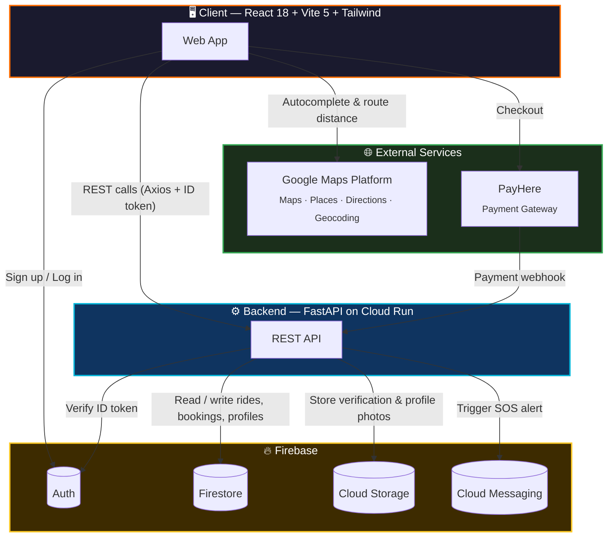

<div align="center">


# ShareWays
### Smart Ride-Pooling & On-Demand Fare-Splitting — Built for Sri Lanka

*Share the ride. Split the cost. Travel smarter.*

<br/>


<br/>


</div>

<br/>

## 📖 About

**ShareWays** (formerly *CommuteShareSL*) is a smart carpooling and fare-splitting platform built for daily commuters in Sri Lanka — inspired by BlaBlaCar and QuickRide, adapted for local roads, local vehicles (car, van, bike, tuk-tuk), and local fuel economics.

Instead of running a taxi-style per-km fare, ShareWays helps a driver who's already making a trip find passengers heading the same way and **split the real fuel cost fairly** — cheaper for passengers, less out-of-pocket for drivers, fewer empty seats on the road.

<br/>

## 📑 Table of Contents

- [Features](#-features)
- [Architecture](#-architecture)
- [Tech Stack](#-tech-stack)
- [Project Structure](#-project-structure)
- [Getting Started](#-getting-started)
- [Firestore Schema](#-firestore-schema)
- [API Reference](#-api-reference)
- [Environment Variables](#-environment-variables)
- [Roadmap](#-roadmap)
- [License](#-license)

<br/>

## ✨ Features

<table>
<tr>
<td width="50%" valign="top">

### 🔍 For Passengers
- Search rides across 30+ Sri Lankan cities
- Live map-based pickup & drop-off (Google Places)
- Real-time seat availability
- Transparent per-seat cost before booking
- One-click, transaction-safe seat booking

</td>
<td width="50%" valign="top">

### 🚗 For Drivers
- Post a ride in under a minute
- Vehicle type: Car · Van · Bike · Tuk-tuk
- Fuel Cost Calculator — direct entry or by-distance
- Co-ed friendly or Ladies-only ride mode
- Amenities tags: AC, Luggage space, No smoking

</td>
</tr>
<tr>
<td width="50%" valign="top">

### 🛡️ Safety & Trust
- Verified profile badges
- Emergency contact on file
- One-tap SOS alert (push notification)
- Driver ⇄ passenger mode switch

</td>
<td width="50%" valign="top">

### 💳 Account & Payments
- Firebase email/password authentication
- Password reset flow
- Vehicle & profile management
- PayHere-powered in-app payments

</td>
</tr>
</table>

<br/>

## 🏗️ Architecture



> GitHub renders this diagram automatically — no external image needed.

<br/>

## 🧰 Tech Stack

| Layer | Technology | Purpose |
|---|---|---|
| **Frontend** | React 18 + Vite 5 | Component-based SPA, fast dev/build |
| **Styling** | Tailwind CSS 3 | Utility-first, consistent design system |
| **Backend** | FastAPI (Python) | Async REST API |
| **Auth** | Firebase Authentication | Email/password login, ID token verification |
| **Database** | Firebase Firestore | Real-time NoSQL data store |
| **Storage** | Firebase Cloud Storage | Profile & verification photo uploads |
| **Notifications** | Firebase Cloud Messaging | SOS push alerts |
| **Maps** | Google Maps Platform | Places Autocomplete, Directions, Geocoding |
| **Payments** | PayHere | Local Sri Lankan payment gateway |
| **Hosting** | Google Cloud Run | Backend deployment |

<br/>

## 📂 Project Structure

```
shareways/
├── backend/
│   ├── main.py                  # FastAPI app entry point
│   ├── firebase_admin_setup.py  # Firebase Admin SDK init
│   ├── requirements.txt
│   ├── .env.example
│   ├── serviceAccountKey.json   # ← your key here (gitignored)
│   └── routers/
│       ├── auth.py              # Token verification, profile CRUD
│       ├── rides.py             # Ride offer CRUD + search
│       └── bookings.py          # Seat booking with transactions
└── frontend/
    ├── index.html
    ├── vite.config.js
    ├── tailwind.config.js
    ├── .env.example
    └── src/
        ├── App.jsx              # Router
        ├── firebase.js          # Firebase client SDK (auth)
        ├── api.js               # Axios client
        ├── contexts/
        │   └── AuthContext.jsx
        ├── pages/
        │   ├── SearchRide.jsx
        │   ├── OfferRide.jsx
        │   ├── MyRides.jsx
        │   ├── Profile.jsx
        │   ├── Login.jsx
        │   ├── Register.jsx
        │   └── ForgotPassword.jsx
        └── components/
            ├── Navbar.jsx
            ├── RideCard.jsx
            ├── FuelCalculator.jsx
            └── ProtectedRoute.jsx
```

<br/>

## 🚀 Getting Started

<details>
<summary><b>1. Firebase Project Setup</b></summary>
<br/>

1. Create a project at the [Firebase Console](https://console.firebase.google.com/)
2. Enable **Authentication → Email/Password**
3. Enable **Firestore Database**
4. Generate a **Service Account Key** → save as `backend/serviceAccountKey.json`
5. Register a **Web App** and copy the config values

</details>

<details>
<summary><b>2. Backend Setup</b></summary>
<br/>

```bash
cd backend
python -m venv venv
venv\Scripts\activate        # Windows
# source venv/bin/activate   # Mac/Linux

pip install -r requirements.txt
copy .env.example .env

uvicorn main:app --reload
```

Runs at **http://localhost:8000** · Docs at **http://localhost:8000/docs**

</details>

<details>
<summary><b>3. Frontend Setup</b></summary>
<br/>

```bash
cd frontend
npm install
copy .env.example .env
npm run dev
```

Runs at **http://localhost:5173**

</details>

<br/>

## 🗄️ Firestore Schema

| Collection | Purpose |
|---|---|
| `users` | Profile — name, phone, vehicle details, verification status |
| `rides` | Ride offers with seat tracking |
| `bookings` | Booking records with status |
| `ratings` | Post-ride driver ⇄ passenger reviews |

**Recommended index:** `rides` — `date ASC`, `departure_time ASC`

<br/>

## 🔌 API Reference

| Method | Endpoint | Auth | Description |
|:---:|---|:---:|---|
| `GET` | `/` | — | Health check |
| `POST` | `/api/auth/verify-token` | ✅ | Verify Firebase token |
| `GET` | `/api/auth/profile` | ✅ | Get user profile |
| `PUT` | `/api/auth/profile` | ✅ | Update user profile |
| `POST` | `/api/rides` | ✅ | Create ride offer |
| `GET` | `/api/rides/search` | — | Search rides |
| `GET` | `/api/rides/my` | ✅ | Get own rides |
| `GET` | `/api/rides/{id}` | — | Get ride details |
| `DELETE` | `/api/rides/{id}` | ✅ | Delete own ride |
| `POST` | `/api/bookings` | ✅ | Book a seat |
| `GET` | `/api/bookings/my` | ✅ | Get own bookings |
| `DELETE` | `/api/bookings/{id}` | ✅ | Cancel booking |

<br/>

## 🔐 Environment Variables

<details>
<summary><b>Backend (<code>backend/.env</code>)</b></summary>

```env
FIREBASE_SERVICE_ACCOUNT_KEY_PATH=serviceAccountKey.json
FRONTEND_URL=http://localhost:5173
```
</details>

<details>
<summary><b>Frontend (<code>frontend/.env</code>)</b></summary>

```env
VITE_FIREBASE_API_KEY=...
VITE_FIREBASE_AUTH_DOMAIN=...
VITE_FIREBASE_PROJECT_ID=...
VITE_FIREBASE_STORAGE_BUCKET=...
VITE_FIREBASE_MESSAGING_SENDER_ID=...
VITE_FIREBASE_APP_ID=...
VITE_API_BASE_URL=http://localhost:8000
VITE_GOOGLE_MAPS_API_KEY=...
```
</details>

<br/>

## 🗺️ Roadmap

- [x] Ride search & offer with map-based pickup/drop-off
- [x] Fuel cost calculator (direct + by-distance)
- [x] Emergency contact + SOS button (FCM push)
- [ ] ID-verified profile badges (admin-reviewed)
- [ ] Post-ride ratings & reviews
- [ ] Recurring daily-commute rides
- [ ] In-app driver ⇄ passenger chat
- [ ] PayHere checkout flow
- [ ] Admin dashboard

<br/>

## 📄 License

Distributed under the **MIT License** — see `LICENSE` for details.
<br/>
🌐 **Live Demo:** [gen-lang-client-0442992261.web.app](https://gen-lang-client-0442992261.web.app)

<br/>

<div align="center">

**Built by ** · Cloud Computing Undergraduate, SLTC 🇱🇰

*Inspired by BlaBlaCar & QuickRide — reimagined for Sri Lankan roads.*

</div>
